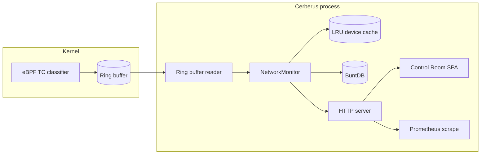

# System overview

Cerberus is one process (`cmd/cerberus`) that attaches an eBPF Traffic Control (TC) classifier to selected interfaces, reads parsed events from a ring buffer, and maintains in-memory and on-disk state. A built-in HTTP server exposes JSON APIs, Prometheus metrics, and the embedded **Control Room** web UI.

## 1. Kernel path (eBPF)

- **Program**: `ebpf/cerberus_tc.c` — TC ingress classifier on each monitored interface.
- **Role**: Parse L2/L3/L4 headers and fixed-size **L7 preview** (first 128 bytes) for ARP, TCP, UDP, ICMP, DNS, HTTP, and TLS-shaped traffic.
- **Output**: Fixed-size **network events** (see `internal/models` and BPF `struct network_event`) pushed to a **BPF ring buffer** map named for producer/consumer sync with userspace.

IPv4 and IPv6 paths are supported; event layout includes IP version flags and address fields consumed by Go.

## 2. Userspace ingest (Go)

- **Ring buffer reader**: `cmd/cerberus` loads the compiled BPF object (`cerberus_tc.o`), attaches programs, and polls the ring buffer.
- **Hand-off**: Each decoded event is passed to `internal/monitor` (`NetworkMonitor.TrackEvent`).

## 3. Monitor (`internal/monitor`)

Core responsibilities:

| Concern | Behavior |
|---------|----------|
| **Devices** | LRU cache keyed by source MAC; merge with BuntDB persistence for `DeviceInfo` across restarts. |
| **Vendor** | `internal/databases` OUI lookup (IEEE MA-L CSV cache or fallback; optional online lookup when enabled). |
| **Service labels** | Port + protocol → IANA-style name via `internal/databases` service registry (CSV cache or fallback). |
| **Traffic typing** | Heuristics classify ARP/TCP/UDP/ICMP/DNS/HTTP/TLS-style flows and correlated DNS→connection patterns where possible. |
| **Aggregates** | Per-device counters and maps: services, DNS domains/types/response codes, HTTP hosts, TLS SNIs/versions, encrypted-DNS hints, targets, GeoIP fields (optional). |
| **Patterns** | New communication patterns deduplicated and optionally logged; channel for downstream use. |
| **Rule alerts** | Threshold-based `AlertEvent` list (e.g. DNS rate, TCP fan-out, unique targets) with configurable limits. |
| **Anomaly detector** | Time-windowed “ML-lite” scoring over a feature vector (robust statistics + centroid distance); emits `AnomalyAlert` entries with human-readable summary and per-feature contributions; snapshot exposed to API. See [ml-anomaly-detection.md](ml-anomaly-detection.md). For SYN/flood/scan-style interpretations of those features (and limits), see [threat-and-anomaly-patterns.md](threat-and-anomaly-patterns.md). |
| **Persistence** | BuntDB under configurable path (default `./data/network.db` from main); periodic persistence worker. |

Optional **MaxMind GeoLite2** enrichment: set `CERBERUS_GEOIP_DB` to a `.mmdb` path; public IPs on devices can receive country/city fields.

## 4. Databases (`internal/databases`)

| Database | Purpose |
|----------|---------|
| **OUI** | MA-L vendor strings; cache file under `CERBERUS_DATA_DIR` (default `./data`); optional refresh when `CERBERUS_DB_ONLINE` is set. |
| **Services** | IANA service-name / port assignments (TCP/UDP); CSV cache with quoted-field parsing and modest port-range expansion. |

These are **offline-first**: embedded fallbacks work without downloads.

## 5. HTTP API and static UI (`internal/api`)

- **REST** (`/api/v1/…`): JSON for summary, full device list, rule alerts, anomaly snapshot. See [api-reference.md](api-reference.md).
- **Concurrency**: handlers read **snapshots** of devices and packet counters under the monitor mutex so high event rates (for example many TCP SYNs) cannot trigger `fatal error: concurrent map iteration and map write` while JSON is encoded.
- **Metrics**: `GET /metrics` — Prometheus exposition from monitor counters.
- **Static UI**: `internal/api/web/*` embedded with `go:embed`; served from `/` (e.g. `/`, `/app.js`, `/styles.css`).

Bind address: `CERBERUS_HTTP_ADDR` (default `127.0.0.1:8080`). Use `0.0.0.0:8080` inside containers when publishing a port.

## 6. Data flow (simplified)

## 7. Security and privacy (summary)

- Requires elevated privileges to attach TC/eBPF programs.
- Stores **metadata and small L7 snippets** (e.g. DNS query names, HTTP Host, TLS indicators), not full packet captures.
- Default operation does **not** call the internet; enabling `CERBERUS_DB_ONLINE` may fetch IEEE/IANA registries. GeoIP is a local file only.

## 8. Where to change behavior

| Goal | Likely location |
|------|-----------------|
| New protocol / BPF fields | `ebpf/cerberus_tc.c`, `internal/models`, `internal/utils`, ring buffer reader in `cmd/cerberus` |
| Classification or alert rules | `internal/monitor` |
| API shape or new route | `internal/api/server.go`, `internal/models` |
| Dashboard copy or layout | `internal/api/web/index.html`, `app.js`, `styles.css` |
| Vendor / port naming | `internal/databases` |
