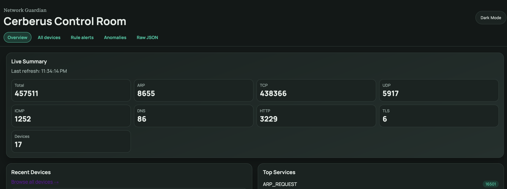
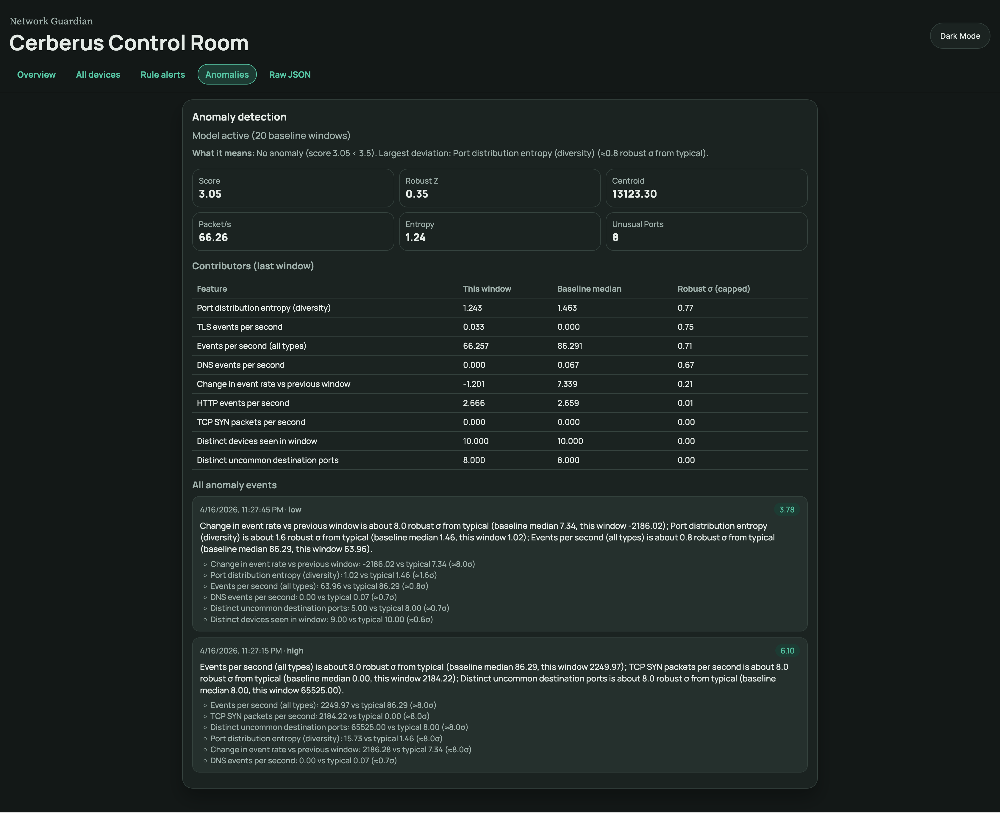
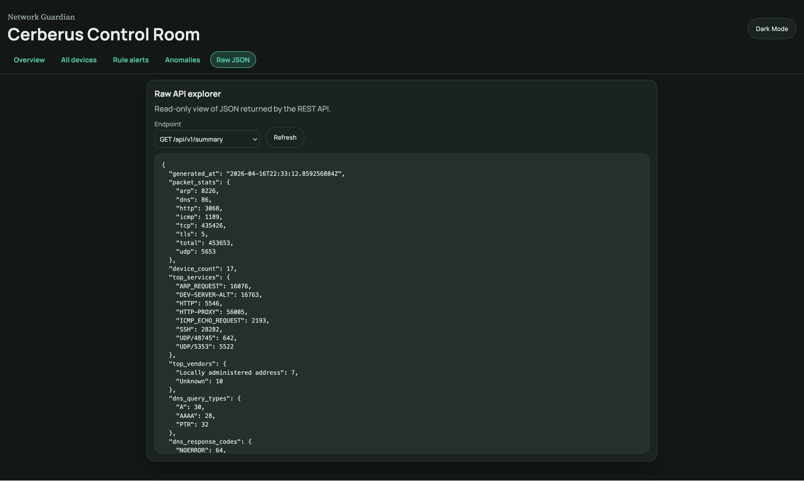
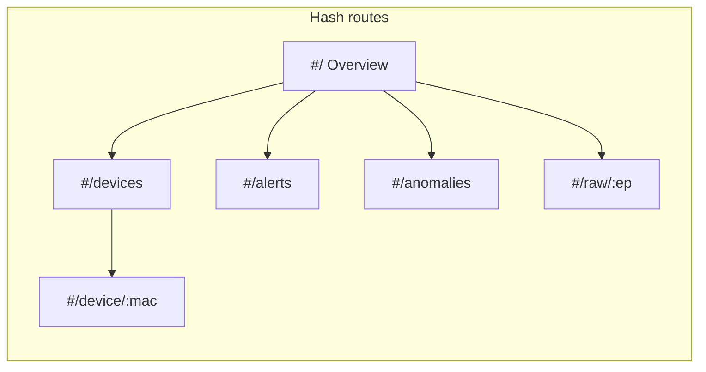

# Control Room (web UI)

The **Control Room** is a static, client-rendered SPA embedded in the binary. It has **no build step**: plain HTML, CSS, and JavaScript. Navigation uses the URL **hash** so the server always serves `/` and routing stays client-side.

## Global chrome

Every screen shares:

| Region | Elements |
|--------|----------|
| **Top bar** | Eyebrow “Network Guardian”, title “Cerberus Control Room”, theme toggle |
| **Primary nav** | Links: Overview, All devices, Rule alerts, Anomalies, Raw JSON |

Data refresh: the client polls REST endpoints on an interval and re-renders the **active** route (the Raw JSON page also fetches on demand when selected).

## Route map

| Hash | Screen | Purpose |
|------|--------|---------|
| `#/` | Overview | Fleet-wide snapshot |
| `#/devices` | All devices | Sortable-style table of MAC, IP, vendor, counts, last seen |
| `#/device/<encoded-mac>` | Device detail | Full `DeviceInfo`-style breakdown (maps, targets, geo, timestamps) |
| `#/alerts` | Rule alerts | Table of threshold-based `AlertEvent` rows |
| `#/anomalies` | Anomalies | Full anomaly snapshot: status, plain-language insight, metrics, contributor table, extended alert list |
| `#/raw/summary` (etc.) | Raw JSON | Endpoint picker + pretty-printed JSON body |

MAC in the device route uses `encodeURIComponent` (e.g. `%3A` for `:`).

## Screenshots

Reference captures of the embedded Control Room (exact theme and spacing may differ slightly from your build):

**Overview** (`#/`)



**Anomalies** (`#/anomalies`)



**Raw JSON** (`#/raw/...`)



## Wireframe: Overview (`#/`)

ASCII layout (grid may reflow on narrow viewports):

```
┌─────────────────────────────────────────────────────────────────┐
│ Live summary                                                    │
│  [ Total ] [ ARP ] [ TCP ] [ UDP ] [ ICMP ] [ DNS ] [ HTTP ] …  │
│  generated-at timestamp                                         │
├────────────────────────────┬────────────────────────────────────┤
│ Recent devices             │ Top services                       │
│  card per device           │  ranked list                       │
│  (link → device detail)    │                                    │
├────────────────────────────┼────────────────────────────────────┤
│ Top vendors                │ DNS query types                    │
├────────────────────────────┼────────────────────────────────────┤
│ DNS response codes         │ (spacer / flow)                    │
├────────────────────────────┴────────────────────────────────────┤
│ Anomaly detection (ML-lite)                                     │
│  status line · “What it means” paragraph · metric stat cards    │
│  Recent anomalies (list) · link to full history                 │
└─────────────────────────────────────────────────────────────────┘
```

**API**: the client merges **`GET /api/v1/summary`** (aggregates + recent device cards) with **`GET /api/v1/anomalies`** (teaser metrics and recent alerts) on the same polling tick as other routes.

## Wireframe: All devices (`#/devices`)

```
┌─────────────────────────────────────────────────────────────────┐
│ All devices                                                     │
│ short helper text                                               │
├───────┬─────┬────────┬─────┬──────┬─────┬───────────────────────┤
│ MAC ▶ │ IP  │ Vendor │ DNS │ HTTP │ TLS │ Last seen             │
│ …     │ …   │ …      │ …   │ …    │ …   │ …                     │
└───────┴─────┴────────┴─────┴──────┴─────┴───────────────────────┘
```

**API**: `GET /api/v1/devices`.

## Wireframe: Device detail (`#/device/...`)

```
← All devices

┌─────────────────────────────────────────────────────────────────┐
│ Title: "<IP> · <Vendor>"                                        │
├─────────────────────────────────────────────────────────────────┤
│ Key stat cards (MAC, IP, geo, counts, first/last seen, …)       │
│ “Recent targets” list (if any)                                  │
│ Sections: services, DNS maps, HTTP hosts, TLS SNIs/versions,    │
│   encrypted DNS, correlated domains, traffic-type counts, …     │
│ Link to raw devices JSON                                        │
└─────────────────────────────────────────────────────────────────┘
```

**API**: same device array from `GET /api/v1/devices`; client picks one MAC. Fields omitted from JSON (`json:"-"`) do not appear.

## Wireframe: Rule alerts (`#/alerts`)

Table columns: time, severity, rule id, device MAC, device IP, message.

**API**: `GET /api/v1/alerts`.

## Wireframe: Anomalies (`#/anomalies`)

```
Status + insight paragraph
Metric cards (score, robust Z, centroid, packet/s, entropy, unusual ports)
Contributors (last window) — table: feature, value, baseline, robust σ
All anomaly events — list with severity, score, summary, contribution bullets
```

**API**: `GET /api/v1/anomalies`.

Plain-language copy is shown first; **Technical details behind the reasoning** is a `<details>` block with the median/σ paragraph and per-feature lines.

## Wireframe: Raw JSON (`#/raw/...`)

```
Endpoint [ dropdown: summary | devices | alerts | anomalies ]  [ Refresh ]
┌─────────────────────────────────────────────────────────────────┐
│  pretty-printed JSON in scrollable <pre>                        │
└─────────────────────────────────────────────────────────────────┘
```

**API**: direct `GET` to the chosen `/api/v1/...` path (not the same payload shape as summary-only).

## Mermaid: navigation state



## Accessibility and theming

- System **dark/light** preference via CSS; manual override via `data-theme` on `<html>` controlled by the toggle.
- Main landmark: nav has `aria-label="Main"`; raw JSON `<pre>` is focusable for keyboard scroll.

## Related

- [api-reference.md](api-reference.md) — exact HTTP paths and metrics.
- [system-overview.md](system-overview.md) — how monitor state feeds these responses.
- [ml-anomaly-detection.md](ml-anomaly-detection.md) — how the anomaly “ML-lite” model works and what JSON fields mean.
